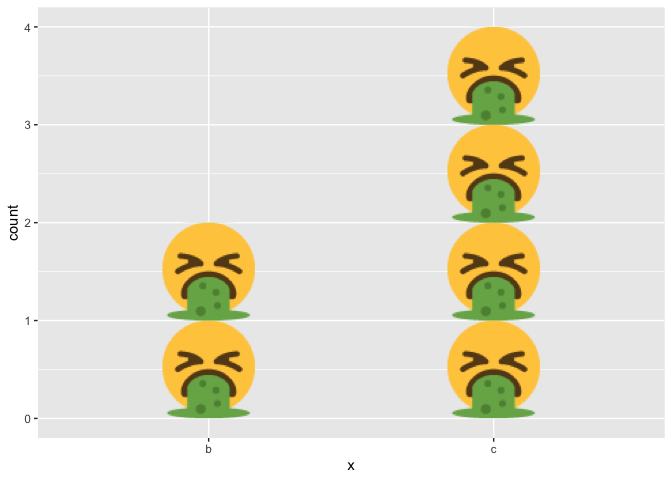

<!-- badges: start -->

[](https://travis-ci.org/karawoo/ggbarf)
<!-- badges: end -->

<!-- README.md is generated from README.Rmd. Please edit that file -->

# ggbarf

A sickeningly awesome geom.

Thanks to Claus Wilke for writing
[ggtextures](https://github.com/clauswilke/ggtextures) and thus allowing
me to write this silly package with approximately zero effort.

## Installation

``` r
devtools::install_github("karawoo/ggbarf")
```

## Example

``` r
library("ggbarf")
#> Loading required package: ggplot2
#> Loading required package: ggtextures
set.seed(123)
dat <- data.frame(x = sample(letters[1:3], 6, replace = TRUE))

ggplot(dat, aes(x)) +
  geom_barf()
```



The barf emoji image by [Twitter, Inc. and other
contributors](https://twemoji.twitter.com/) is licensed under
[CC-BY 4.0](https://creativecommons.org/licenses/by/4.0/).
